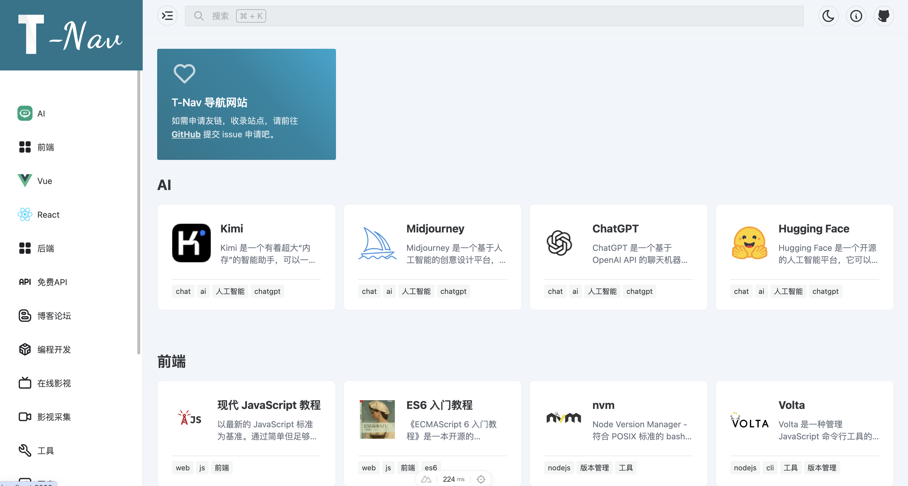
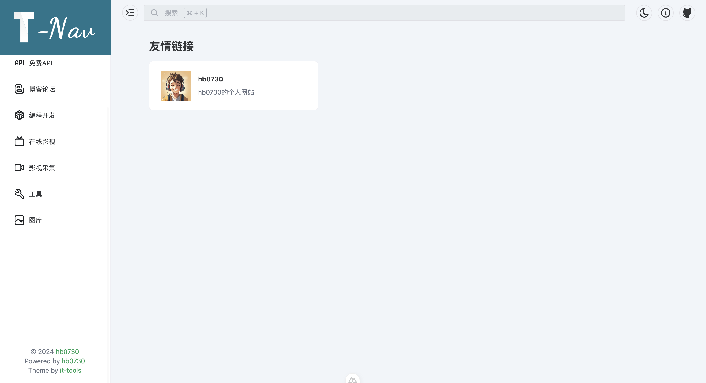

# T-Nav

<!--图片左右 screenshots-->
<p align="center">
  
  
</p>

[T-Nav](https://t-nav.hb0730.me)是一个基于Nuxt+Naive UI开发的静态导航网站，可以用于个人或团队的导航网站，支持自定义分类和网站链接，支持搜索功能。

## 入门

项目采用 [volta](https://volta.sh/) 管理 Node.js 版本，推荐使用 volta 管理 Node.js 版本。

```bash
# 安装依赖
pnpm install
# 启动
pnpm run dev
```

## 网站配置

网站配置文件位于 `nuxt.config.ts`，可以配置网站名称、网站描述、网站图标、网站背景、网站主题等。

```json
{
  "url": "https://t-nav.hb0730.me", // 网站地址
  "name": "T-Nav 导航网站", // 网站名称
  "description": "\"T-Nav\" 是一个专门为开发者和技术爱好者设计的导航网站。它提供了一站式的解决方案，包括编程学习资源、开发工具、开源项目以及最新的技术动态。无论你是初学者，还是经验丰富的开发者，\"T-Nav\" 都能帮助你快速找到所需的资源，提升你的开发效率和学习效果。我们的目标是让技术更加触手可及，让每一个用户都能在 \"T-Nav\" 找到属于自己的技术之路。",
  "keywords": "T-Nav,导航网站,编程资源,开发者工具,在线学习,编程教程,开源项目,技术新闻,技术社区,开发者社区,编程语言,前端开发,后端开发,全栈开发,JavaScript,Python,Java,C++,Ruby,Go,PHP,Swift,Kotlin,Rust,TypeScript,Vue,React,Angular,Django,Flask,Spring,Laravel,Ruby on Rails,Node.js,Docker,Kubernetes,DevOps,云计算,大数据,人工智能,机器学习,深度学习,数据科学,网络安全,区块链\",",
  "author": "hb0730",
  "defaultLocale": "zh-CN",
  "authorLink": "https://hb0730.me",
  "icon": "https://t-nav.hb0730.me/favicon.ico",
  "logo": "https://t-nav.hb0730.me/logo.png",
  "icp": ""
}
```

## 网站数据

网站数据位于 `data` 目录下，可以配置网站分类和网站链接。 **目前支持一级**

关于logo,icon等图片资源，支持本地和网络图片以及@iconify 图标。

```json
{
  "title": "后端", // 分类名称
  "children": [
    {
      "title": "SDKMAN", // 网站名称
      "url": "https://sdkman.io/",
      "logo": "https://sdkman.io/assets//img/sdk-man-small-pattern.svg",
      "description": "SDKMAN! 软件开发工具包管理器",
      "tags": ["cli", "SDK", "工具", "版本管理", "java", "JDK"]

    }
  ]
}
```
